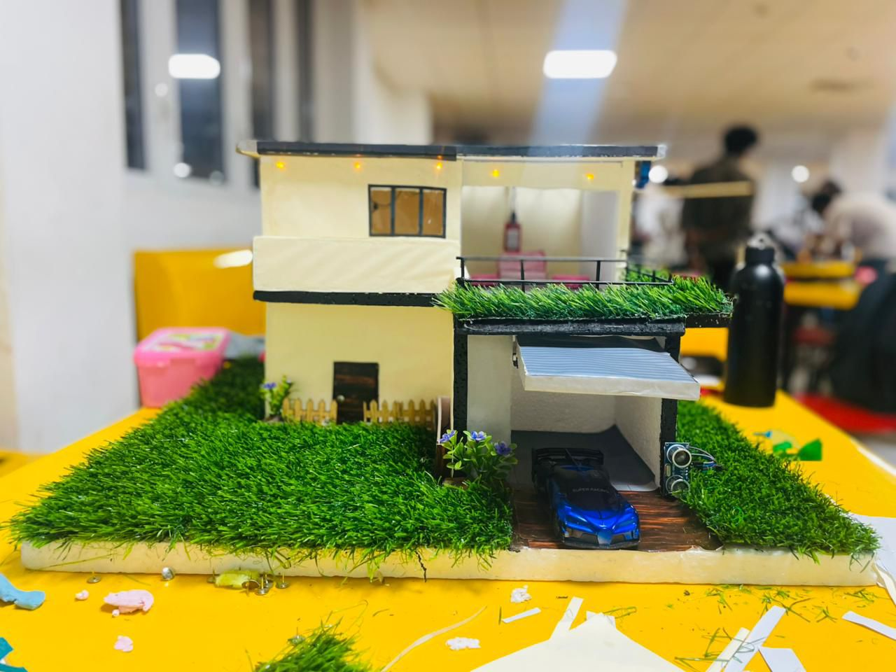
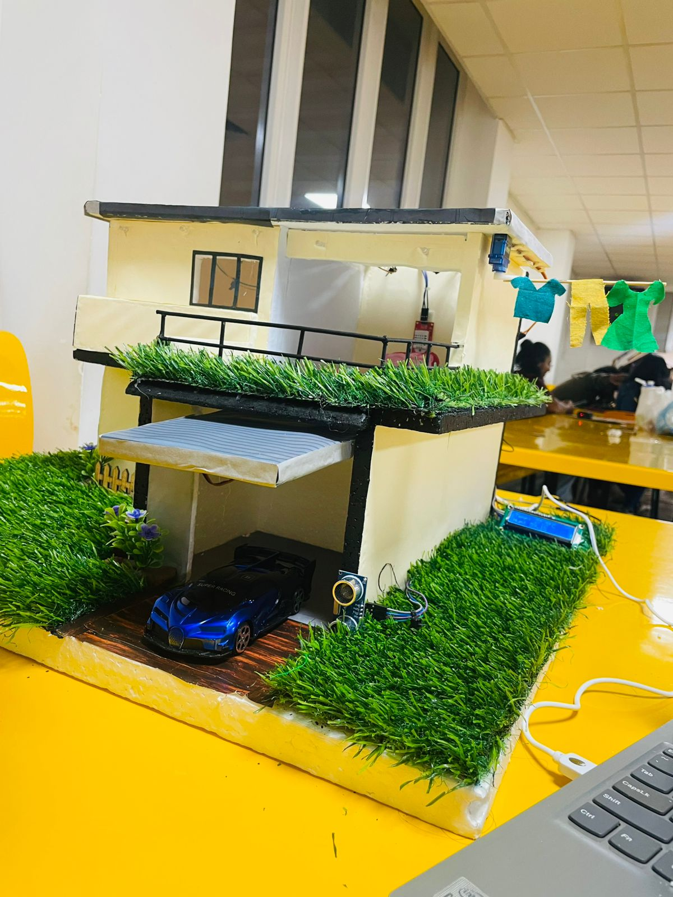
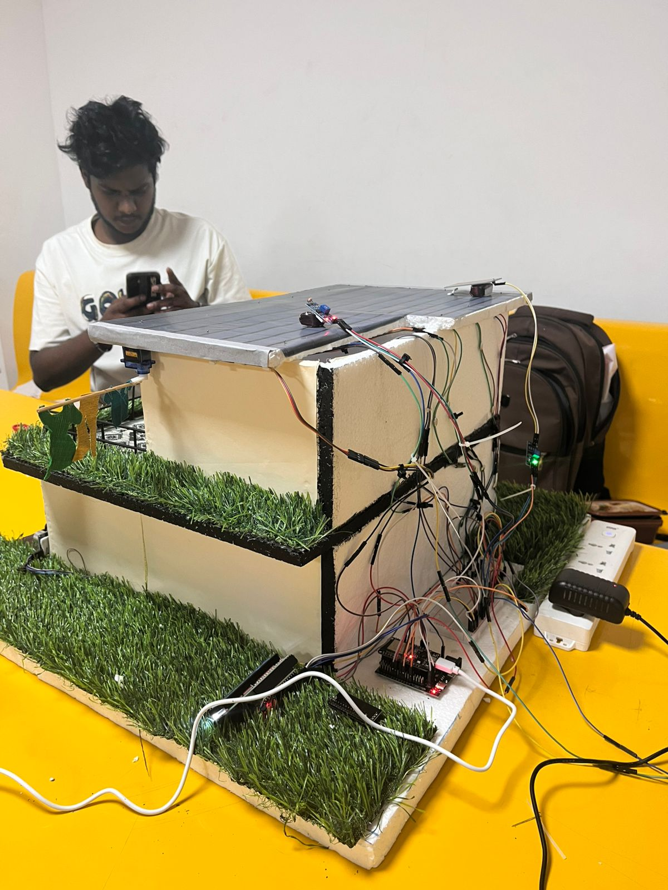

# 🏠 Home Automation System (ESP32)

<p align="center">
  <b>Smart IoT-based Home Automation using ESP32, Sensors & Blynk</b>
</p>

---

## 📌 Overview
This project is a **smart home automation system** built using ESP32.  
It automates household tasks and allows remote control via a mobile app.

---

## ✨ Features

🚪 **Smart Door System**
- Automatic door opening (Ultrasonic sensor)
- Manual control via button & app

🌧️ **Clothesline Automation**
- Detects rain
- Auto retracts clothesline

🌡️ **Temperature & Humidity**
- DHT22 sensor monitoring
- LCD + mobile display

💡 **Smart Lighting**
- LDR-based automatic lighting
- Manual control available

📱 **IoT Control**
- Controlled using Blynk app

---

## 🛠️ Tech Stack

- 💻 C++ (Arduino)
- 📡 ESP32
- 📱 Blynk IoT Platform
- 🗄️ Sensors: DHT22, LDR, Rain, Ultrasonic
- ⚙️ Components: Servo Motors, LCD, LEDs

---

## 🔌 Hardware Components

- ESP32  
- Servo Motors (2)  
- Ultrasonic Sensor  
- DHT22 Sensor  
- Rain Sensor  
- LDR Sensor  
- LCD Display (I2C)  
- Push Buttons  
- LED  

---

## 📷 Project Images


<p align="center">
  
  
   
</p>

<p align="center">
  
  
</p>

---


## 🚀 Getting Started

### 1️⃣ Install Requirements
- Arduino IDE  
- Required libraries:
  - Blynk  
  - ESP32Servo  
  - DHT sensor  
  - LiquidCrystal I2C  

---

### 2️⃣ Setup Credentials

<!--```cpp
#define BLYNK_AUTH_TOKEN "YOUR_TOKEN"
char ssid[] = "YOUR_WIFI";
char pass[] = "YOUR_PASSWORD";-->

### 3️⃣ Run Project

1. Connect ESP32
2. Upload code
3. Power the system
4. Monitor via Blynk app

---

## 📊 System Flow

* Sensor detects input
* ESP32 processes data
* Action triggered (servo/light)
* Data sent to mobile app

---

## 👨‍💻 Author

**Himath Sathmin**
🎓 IT Undergraduate
📊 Aspiring Data Scientist & Software Engineer

---

## ⭐ Support

If you like this project, give it a ⭐ on GitHub!


---


